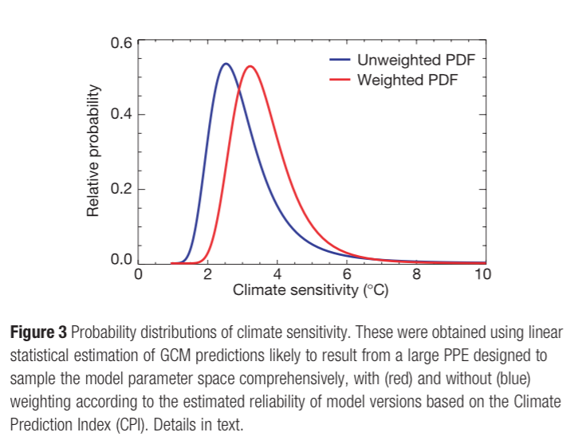

Usually some form of averaging giving different weights to different models, usually weighted in some way so that those that are thought to be more plausible are weighted more strongly

What about when you don't have a common metric like AIC?
Cross-validation weights?

Multi-criteria decision analysis
e.g. return-risk for portfolios
<http://en.wikipedia.org/wiki/Multiple-criteria_decision_analysis>
decision space that's bounded

Min-max solution

Bagging vs. boosting vs. blending in machine learning

Nice summary here: <http://stats.stackexchange.com/questions/19224/combining-machine-learning-models>

What we're thinking of doing may fit best into 'blending'

Also 'ensemble' model. See @caruana2004 for a nice paper on ensemble selection. Or 'Ensemble methods'

Can you boost with multiple models? How do you decide the order? 

Note that as the number of models to combine increases the probability of overfitting increases. Therefore, bagging becomes very important @caruana2004.

# Things to think about:
1. What performance metric is desirable? Multiple metrics?
2. How independent are the models? (not going to gain much from combining highly dependent models)

Note the difference between continuous responses and classification (where vote counting is often used)

See:
1. Feature-Weighted-Linear Stacking (used in the Netflix competition apparently)
2. "Bucket of models": use model output as a 'feature vector'

## @tebaldi2007:
- key paper: review of 'multi-model ensembles for climate projections'
- famous one is DEMETER: Development of a European Multi-model Ensemble System for Seasonal to Inter- annual Prediction @hagedorn2005 is a good reference
- 'Structural uncertainty' comes from the elements of reality that are necessarily ignored in any given model; different models may have different structural uncertainty
- Structural uncertainty is the main motivation behind working with an ensemble of models
- Examples of where ensemble models are shown to be better than any one: @thomson2006 (public health - malaria), @cantelaube2005 (agriculture - crop yield)
- ENSO predictions usually better in multi-model ensembles [@palmer2005]
- biggest improvements of ensembles over single models comes from considering 'aggregate performance measures' - 'consistently better performance of the multi-model when considering all aspects of the predictions' [@hagedorn2005]
- question of whether we should down weight outliers or not --- they may also include important information that is excluded from the other models
- identify 4 groups of problems, three seem relevant to us: model validation metrics, model dependence, model tuning
- climate models tend to largely agree for recreating present-day climate and even projections over typical scenarios in the future... but can diverge strongly in boundary conditions
- simple averages are used very commonly in climate science - e.g. IPCC 2001
- weighting obviously makes sense, but how do we define a performance metric that is based on past observations that is relevant to the future?
- for climate, weighted averages perform better than simple averages [@min2006], but are those same weights applicable to the future (or in our case other fisheries)?
- model independence is important but hard to achieve. For example: models tend to be tuned on the same observations, and we tend to learn and borrow ideas from each other when formulating the structure of our models
- when we build (simulation) models we tend to train them on high probability ranges of parameters (e.g. few climate models allow for up to 6% increase, even though this has substantial probability) [@tebaldi2007]

- error cancellation is one but not the only reason for superiority of ensemble models [@hagedorn2005]
- ensemble model may be only marginally better than the best single model in any given case, but we don't usually know which is the best single model [@hagedorn2005]

- highly cited climate ensemble paper: @stainforth2005; this is about a 'grand ensemble' an 'ensemble of ensembles' (I believe the ensemble part is quite basic.)

- ensemble methods for probabilistic climate change outlook first proposed in @raisanen2001
- @giorgi2002 used an approach they called REA (reliability ensemble average)

## Reliability Ensemble Average approach:
- "model performance" how well can it reproduce today's climate?
- "model convergence" how much do the simulations converge across models?
- minimized the effect outlier/poorly performing models
- creates quantitative measure of reliability
- includes equations to calculate these measures and combine (also summarized in [@tebaldi2007]

- ensemble models useful for regional climate models too [@pierce2009]
- as an example, @pierce2009 use 42 metrics to characterize model performance in regional climate model ensembles
- @pierce2009 found that ensemble models were superior to any one model even when only 3 (of 42 possible) metrics were used

## @knutti2009:
- key review paper on motivation and challenges of combining climate projection models
- big challenges:
  - number of models in ensembles often small
  - extreme behaviour often not sampled
  - performance on testing / current data may only weakly relate to future / other datasets
  - ensembles can result in loss of signal (e.g. loss of fine spatial heterogeneity, which may be averaged out)
  - agreeing on metrics for good/bad is hard
  - models are often developed, evaluated, and tested on the same datasets
- conclude that improved quantitative methods to evaluate model performance are key

## @murphy2004
- Nature paper on ensembles of climate model simulations
- weighted average has higher median prediction, and narrower confidence intervals, than unweighted average for global warming 

## @dietterich2000
- book chapter "Ensemble Methods in Machine Learning"
- highly cited
- original ensemble method was Bayesian averaging
- ensembles are often much more accurate than the "individual classifiers that make them up"
- for ensembles to be more accurate, the individual components must by *accurate* and *diverse* (he cites "Hansen, L., & Salamon, P. (1990). Neural network ensembles. IEEE Trans.
Pattern Analysis and Machine Intell., 12, 993–1001." for this
- lists three "fundamental" reasons why ensemble models may work better (1) statistical, (2) computational, and (3) representational
- statistical: averaging
- computational: local optimum issue --- by starting from multiple places you explore more of possible parameter space
- representational: no one model usually can contain all hypothetical functional forms, but many separate models can cover more hypotheses
- these are issues for any model, and ensemble methods can reduce all of them

Definitive paper showing that ensemble models are most accurate when the various individual models make errors in uncorrelated ways [@ali1996].

- bagging most useful when different sampes from the training dataset generate substantial differences in the estimated model

- look for "from Elder, John. From Trees to Forests and Rule Sets - A Unified Overview of Ensemble Methods. 2007."

- without substantial training-testing data, appropriate model weights can be very hard to deduce and can cause more harm than good (compared to equal weighting) [@weigel2010] (they give the example of seasonal forecasting where a ton of hindcast testing can be done, vs. long-term climate)

Nice figure by @weigel2010 showing the expected benefit of different model averaging approaches (from their simulation):

- optimal weights are always as good or better than equal weights, but if you get the weights wrong, you can be better off just using equal weights
- but averaging was almost always better than any one model (not surprising)
- they suggest this applies specifically in the field of climate change models (but not elsewhere, e.g. in seasonal forecasts), *so what does it look like for fisheries?*
- the ideal weights are not just a function of model error uncertainties, but also (1) amount of *correlation in model errors* and (2) the *magnitude of unpredictable noise* (still [@weigel2010])
- @weigel2010 conclude that there is an asymmetry in loss from the wrong weights vs. the gains from optimal weights
- @weigel2010: not that we shouldn't try, but not easy and requires very good testing data to derive optimal weights

@rykiel1996 "Testing ecological models: the meaning of validation" (see for performance criteria, theory on model testing and assessment)

## @greene2006
- Nice paper that does something similar for climate models (calibration from simulations, build ensemble weights using Bayesian linear model (and test with cross-validation), apply to real data).
- shows a (visual) correlation matrix of different models for various outputs
- compare 3 linear ensemble models of increasing complexity: add variability between regions, add covariance between regions
- compare via DIC and cross-validation MSE: both favour the most complex ensemble model
- this was all done building and testing on observational data
- then applied to forecasting

# References
